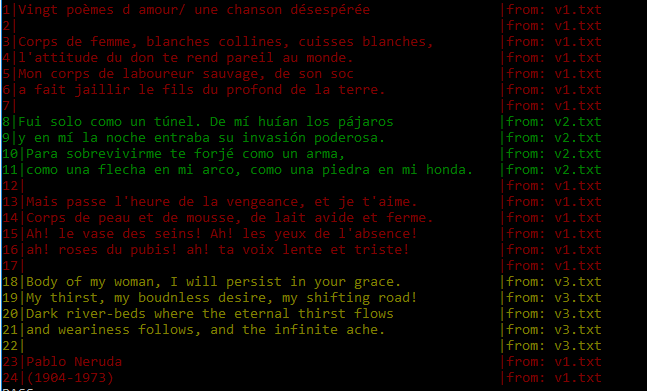

# GoDiff

Simple tools to track changes ( modification and insertion ) between to versions of a content.


## Usage

Initialization of the first version of the file 

```go
	f1, e := readFile("./testdata/v1.txt")
	origin := IniDoc(f1, "version_Id_1")
```

Once Initialized and second version can be compared with the `origin`

```go
	f2, e := readFile("./testdata/v2.txt")
	diff, e := ProcessDiff(origin, f2, "version_Id_2")
```

The generated `diff` can be dumped into a file

```go
	e = diff.dump("./", "my_diff.txt")
```

This file will look like:

```
1|name: lagoon                                                             |from: version_Id_1
2|qualifier: dev2                                                          |from: version_Id_1
3|ekara:                                                                   |from: version_Id_1
4|  distribution:                                                          |from: version_Id_1
5|    repository: ""                                                       |from: version_Id_1
6|    ref: ""                                                              |from: version_Id_1
7|  components:                                                            |from: version_Id_2
8|    distrib:                                                             |from: version_Id_2
9|      repository: https://github.com/blablabla                           |from: version_Id_2
10|      ref: my-addon                                                     |from: version_Id_1
11|      auth:                                                             |from: version_Id_1
12|        method: basic                                                   |from: version_Id_2
13|        password: mypassword                                            |from: version_Id_1
14|        user: myuwer                                                    |from: version_Id_1
15|    helios:                                                             |from: version_Id_1
16|      repository: dummy/openstack-provider                              |from: version_Id_2
17|      ref: fix-modules                                                  |from: version_Id_2
18|    prometheus:                                                         |from: version_Id_2
```

Columns content :

- 1 the line number 
- 2 the line content
- 3 the line version


The generated `diff` can also be dumped into the console

```go
	e = diff.dumpOut()
```

This is an example of the console dump poduced by the test `TestDumpNeruda`

The schown dump is the result of the comparison of [/testdata/v1.txt](./testdata/v1.txt) with [/testdata/v2.txt](./testdata/v2.txt)	and finally with [/testdata/v3.txt](./testdata/v3.txt)


```go
	f1, _ := readFile("./testdata/v1.txt")
	f2, _ := readFile("./testdata/v2.txt")
	f3, _ := readFile("./testdata/v3.txt")

	origin := IniDoc(f1, "v1.txt")
	diff, _ := ProcessDiff(origin, f2, "v2.txt")
	diff, _ = ProcessDiff(diff, f3, "v3.txt")
	diff.dumpOut()

```

Dump on the console :




